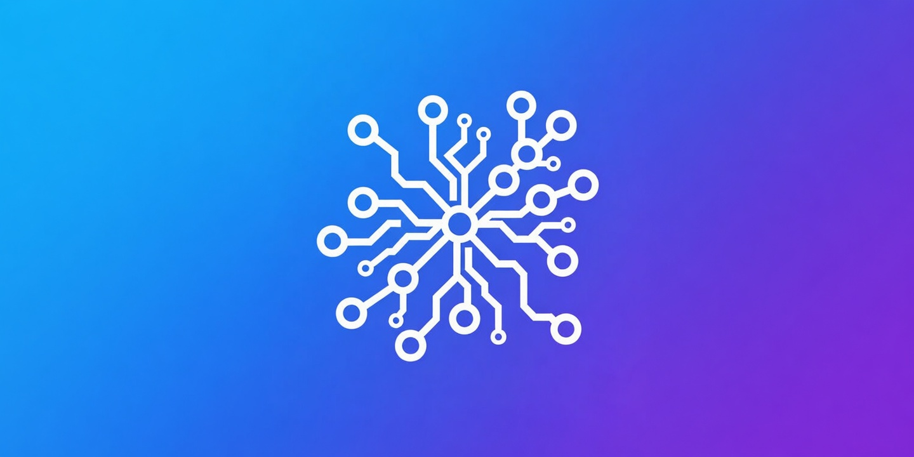

# MyLLM Connect

**Run your own private AI backend on your Mac or PC, and connect the [MyLLM](https://apps.apple.com/gb/app/myllm-local-ai-agent/id6760704297) iOS app to it in one tap — over real HTTPS, from anywhere.**

MyLLM Connect is a small desktop companion (system-tray app for macOS and Windows) that turns "set up a local LLM server my phone can reach" from a multi-step, HTTPS-and-firewall headache into a single QR scan.

## Download

Grab the latest installer from the [releases page](https://github.com/TeamDzX/myllm-connect/releases/latest). The macOS app is **signed and notarized** (universal — Apple Silicon + Intel). The Windows installer is not code-signed yet, so SmartScreen will warn — signing is on the roadmap. You'll also need [Ollama](https://ollama.com) and a free [Tailscale](https://tailscale.com) account; the app guides you through both on first run.

It does three things:

1. **Runs a local model server** on your machine (manages Ollama for you).
2. **Gives it a trusted HTTPS address** your iPhone accepts — privately, over your own [Tailscale](https://tailscale.com) mesh, with a valid certificate. No port-forwarding, no self-signed-cert warnings, works on your home WiFi and when you're out.
3. **Pairs to MyLLM with a QR code** — scan once and the app is configured with the address and a private access key.

Your prompts go straight from your phone to your own machine. Nothing runs in our cloud; we never see your data.

## Why HTTPS matters

iOS only trusts a *valid* certificate. A plain `http://192.168.x.x:11434` Ollama server is rejected by the app's transport security — which is why "just point the app at my PC" usually fails today. MyLLM Connect solves this by giving your machine a real, trusted HTTPS endpoint automatically.

## Locked to MyLLM

The endpoint is useless without the access key minted during pairing, and that key only lives inside your paired MyLLM app. The companion is free and open; the experience it unlocks is the MyLLM app. (See [`PAIRING_PROTOCOL.md`](PAIRING_PROTOCOL.md).)

## Start here (server team)

This repo is the whole handover — no separate doc to chase.

1. **Read the pinned [Epic #11](https://github.com/TeamDzX/myllm-connect/issues/11)** — it sequences every issue, gives the build order, and the definition of done.
2. **Read [`SPEC.md`](SPEC.md)** (what to build, recommendations, open questions) and **[`PAIRING_PROTOCOL.md`](PAIRING_PROTOCOL.md)** (the exact contract).
3. **First moves:** close **#1 (ADR-001 runtime)** and **#2 (ADR-002 model server)** — record them in [`docs/ARCHITECTURE_DECISIONS.md`](docs/ARCHITECTURE_DECISIONS.md) (ADR-003 HTTPS=Tailscale is already decided) — and post your estimate on **#10**.

### You can test against the live app today
**The iOS half is already built and shipped** (MyLLM v2.6 is on the App Store). You do **not** need to wait for the full companion to validate pairing:

- In the app: **Settings → Server → Pair a Backend (scan QR)**.
- Build a QR encoding `myllm://pair?v=1&url=<https>&token=<key>&models=<id>` per [`PAIRING_PROTOCOL.md`](PAIRING_PROTOCOL.md) and scan it.
- Stand up the endpoint by hand first — `ollama serve` behind a bearer-checking proxy, exposed with `tailscale serve` — and you can prove the entire scan → chat-over-HTTPS loop before writing the tray app. Build #3 (auth proxy) and #4 (Tailscale) and you're already testable end-to-end.

## Status

Spec, pairing protocol, and ADRs are in place; implementation is tracked in the issues (start at the pinned epic). The iOS pairing flow it targets is already shipped in MyLLM v2.6.

The Windows companion now implements the full pairing flow (in-process auth proxy → Tailscale serve → QR), verified end-to-end against the live app. The Rust core is cross-platform; **macOS team: see [`docs/MACOS_IMPLEMENTATION.md`](docs/MACOS_IMPLEMENTATION.md)** for the macOS-specific punch list (Tailscale CLI path, menubar/template icon, signing/notarization, flipping on the CI `.dmg` job).

## Not the federation host

This is the **personal backend** onramp: your phone, your server, your data. It is intentionally separate from the opticell *federation* host (sharing your LLM with other users), which has its own repo and its own legal/infra prerequisites. Federation may later appear here as an optional mode; v1 is personal-only.

## License

[Apache-2.0](LICENSE).
